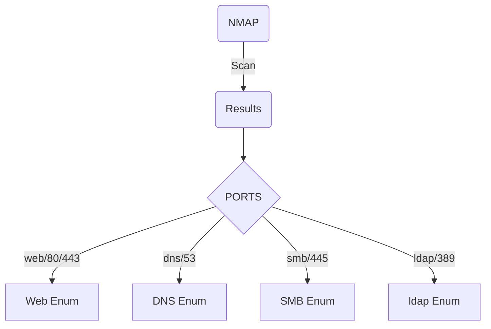

```mermaid
flowchart TD  
    A(NMAP) -->|Scan| B(Results)
    B --> C{PORTS}  
    C -->|web/80/443| D[Web Enum]  
    C -->|dns/53| E[DNS Enum]
    C -->|smb/445| F[SMB Enum]
    C -->|ldap/389| G[ldap Enum]

	click A "nullbr41n/nullbrain/blob/main/active-information-gathering/nmap.md" "NMAP" _blank

```
