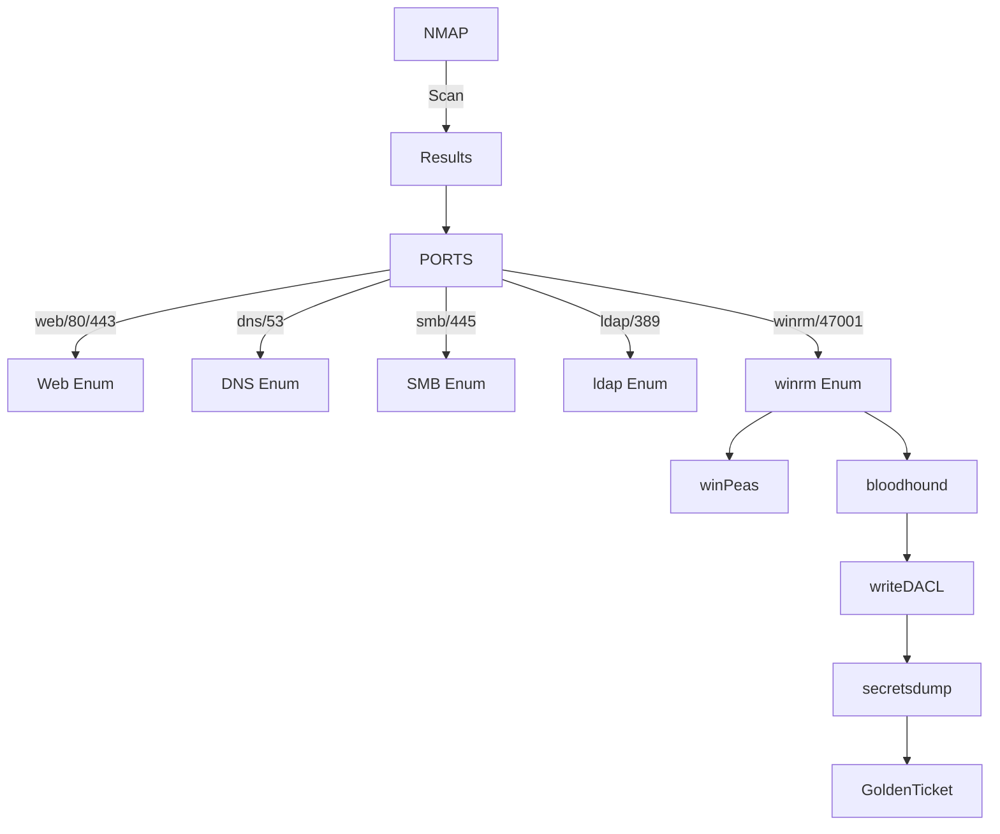

## Verification

Other than NMAP `OS` (`-O`) & version (-`sV`) detection simple ping `ttl` can also indicate if that is windows box. Windows sets `ttl` to `128` and decrements by `1` every-time packet traverse router, whereas, linux devices sets at `64`, `128` + chances are networking devices.

