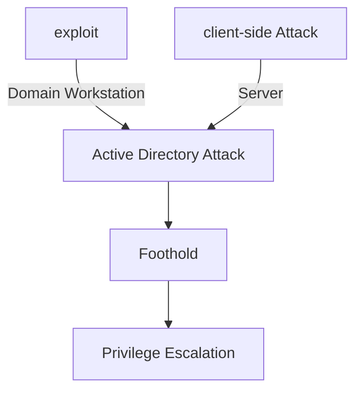

# Overview



## Techniques

- high level groups [Domain Admin group]
- compromise domain controllers
  - contains password hash for every single account
- Enumeration of AD Users & Groups


### Assumptions

#### 1

- Access to windows 10 workstation
- compromised the single user with administrator privileges


##### Enumerate domain users

##### Traditional approach

`net user` : enumerates all location accounts
`net user /domain` : enumerates all users in entire domain

`net user <username> /domain`: 

`net group /domain`:


##### Modern approch

###### powershell

- Objects


```powershell
#Get current domain using DirectoryServices object
$domainOBJ = [System.DirectoryServices.ActiveDirectory.Domain]::GetCurrentDomain()

# power domain control by using name
$PDC = ($domainObj.PdcRoleOwner).Name

# Create searchString
$SearchString = "LDAP://"

# append power domain controller
$SearchString += $PDC + "/"

# Create Distingused name with above $domainobj (.Name e.g corp.com)
$DistinguishedName = "DC=$($domainObj.Name.Replace('.', ',DC='))"

$searchString += $DistinguishedName
```

- Group Query


```powershell

$domainObj = [System.DirectoryServices.ActiveDirectory.Domain]::GetCurrentDomain()

$PDC = ($domainObj.PdcRoleOwner).Name

$SearchString = "LDAP://"

$SearchString += $PDC + "/"

$DistinguishedName = "DC=$($domainObj.Name.Replace('.', ',DC='))"

$SearchString += $DistinguishedName

$Searcher = New-Object System.DirectoryServices.DirectorySearcher([ADSI]$SearchString)

$objDomain = New-Object System.DirectoryServices.DirectoryEntry

$Searcher.SearchRoot = $objDomain

$Searcher.filter="(name=<GROUP_NAME>)"

$Result = $Searcher.FindAll()

Foreach($obj in $Result)
{
   $obj.Properties.member
}
```

```powershell
Foreach($obj in $Result)
{
    Foreach($prop in $obj.Properties.serviceprincipalname)
    {
        # Split by /, print 2nd in index
        # Split by :, print 1st in index
        # And print first of index
        $prop = $prop.split("/")[1].split(":")[0]

        # If string contains .com
        If ($prop -like "*.com"){
            #Run dns resolution
            Resolve-DnsName $prop
        }
    }
}
```

### Nice Reads
https://gitbook.brainyou.stream/powershell/offensive-powershell

