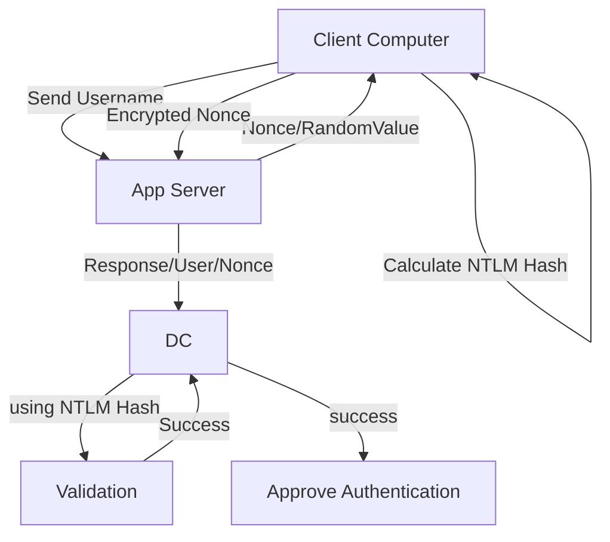
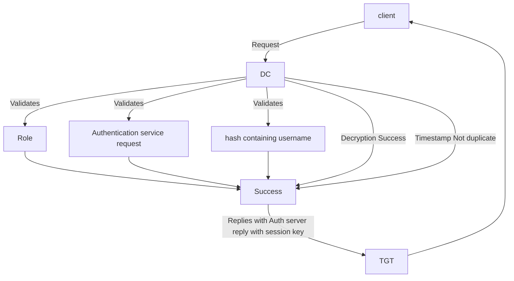

# AD Authentication

## NTLM Authentication



## Kerberos Authentication 



```mermaid
graph TD;

A[client] -- TGService Request --> B[DC]
B -- TGS validation -- TGServer Reply --> A[Client] 
```