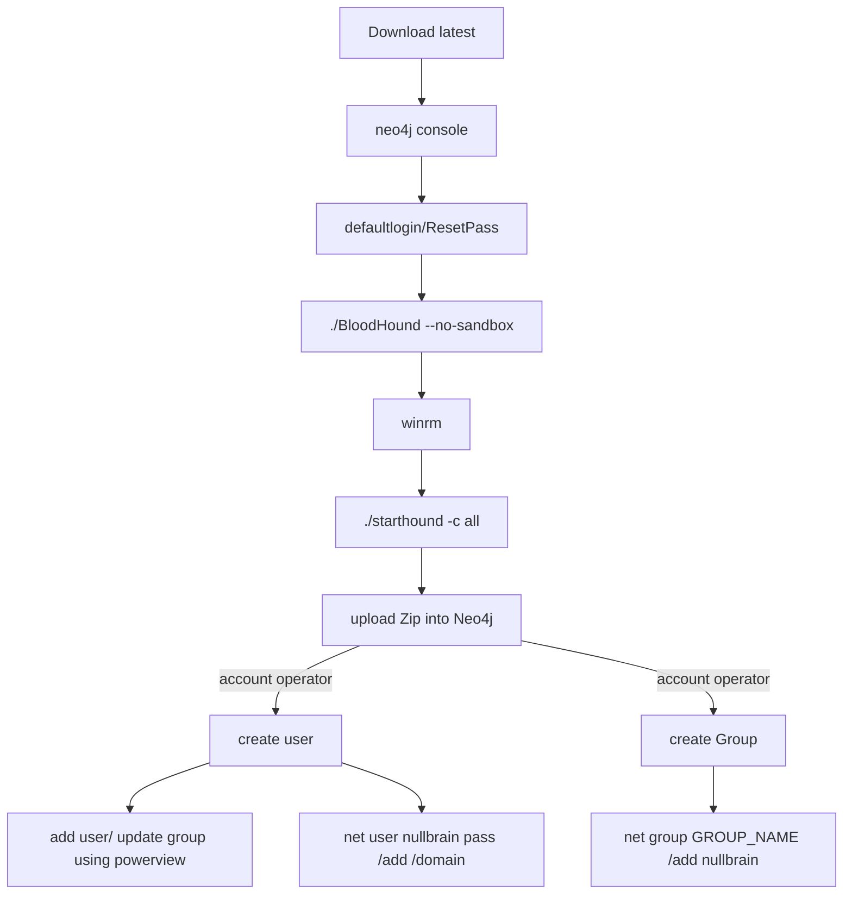

# Bloodhound

- Download latest bloodhound.
	- Unzip
		- Before start/ Start neo4j console.
			- dbms/auth needs to be clean if its previously installed
				- trigger neo4jconsole, run with default, reset password.
					- now start bloodhound/ login with above password
				- winrm
					- start sharphoud ()
						- Drop bloodhoud zip into console, and it will process and load 
							- NOTE: sometimes these can be found by ide & blocked.
						- Once it loads, set what is already owned.
						- shortest path from owned pricipals is good idea to see graph of how its connect.
						- This shows all the connections between parent/member & exchange
						- Create own user probably is good idea than changing anything at this point in time.
						- Create user add user to existing group if possible
							- Can be done via `powerview` or `net user`
						- writeDacl require powerview.
							- [Download powerview, Howto](./writeDACL.md)
