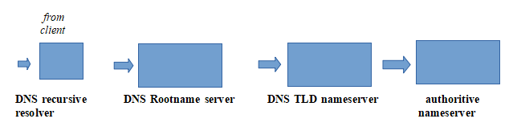

# DNS

How DNS Works?

When one enters URL e.g `www.google.com` in browser; The browser passes the hostname to the operating system's DNS client, starting from e.g '/etc/hosts' in unix system which then takes it to the resolver and the operating system then forwards the request to the DNS server it is configured to use in resolv.conf. This first server in the chain is known as the DNS recursor and is responsible for interacting with the DNS infrastructure and returning the results to the DNS client. The DNS recursor contacts one of the servers in the DNS root zone. The root server then responds with the address of the server responsible for the zone containing the Top Level Domain \(TLD\), `.com`. Once Recursor receives TLD it queries for authoritative nameserver for google.com, which then gives ip for the respective domain. 

[For more details on DNS, let's do more reading at this really good document](https://www.presslabs.com/how-to/dns-records/).

