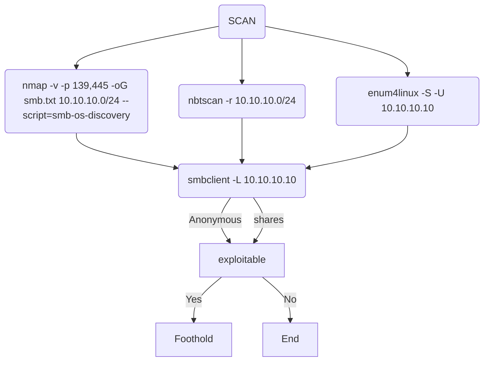

# SMB

## enum


| Description|Netbios|Netbios over TCP|
| ---------|-----------|-----------|
|KNOWN|netbios| smb|
|PORT |139| 445 |
|PROTOCOL|TCP/UDP| TCP |
|OSI|OSI: Session Layer |session layer/Presentation Layer|




### Anonymous

`smbclient -U guest //10.10.10.10/<share>`


```enum4linux
-U        get userlist
-S        get sharelist
```
