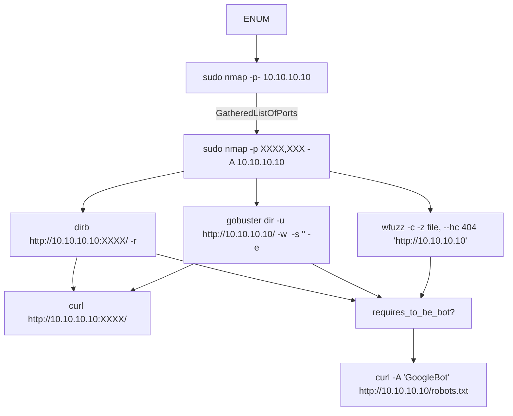
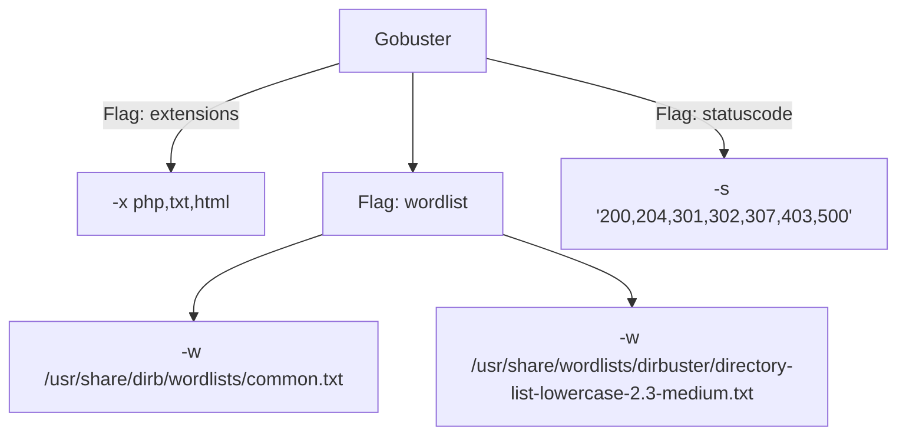
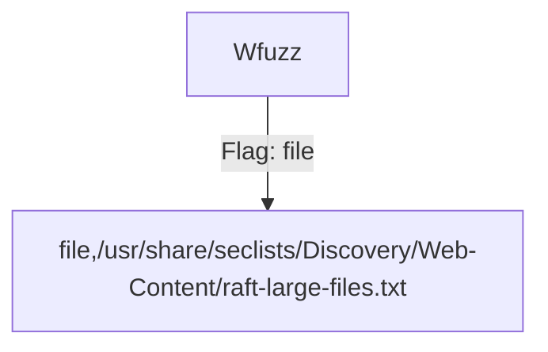

* An attempt to build enum mindmap

### assumption
- `10.10.10.10` is victim
- `XXXX` or `XXXX,XXXX` : one or many ports

### MindMap

#### Gobuster

- Flag & options

#### WFuzz

- Flag & options

